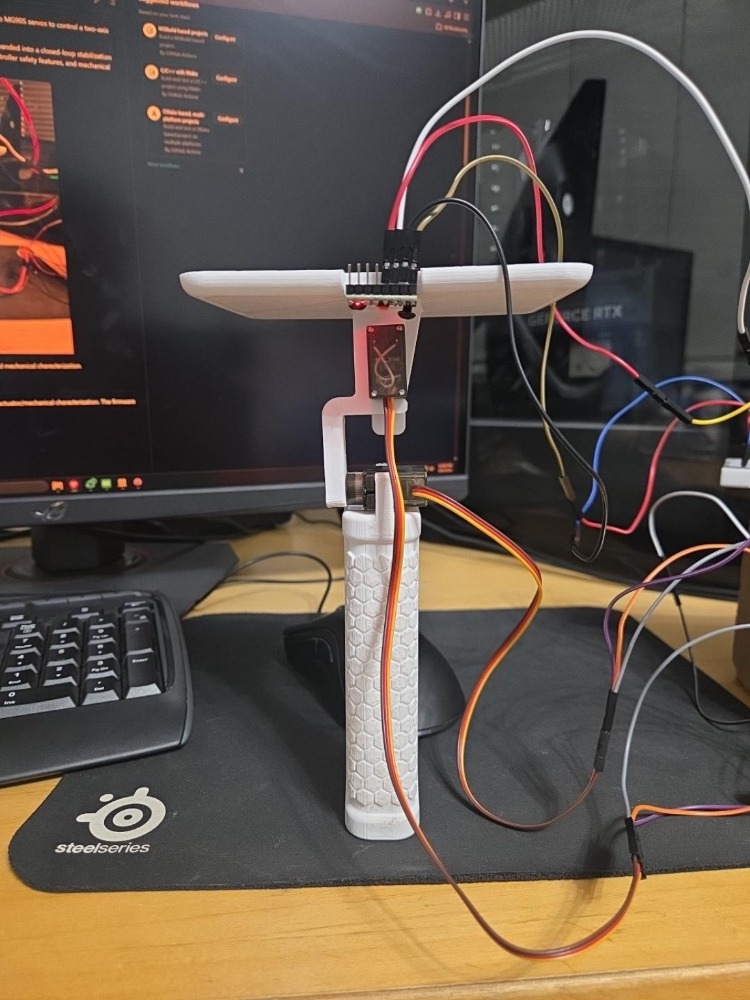
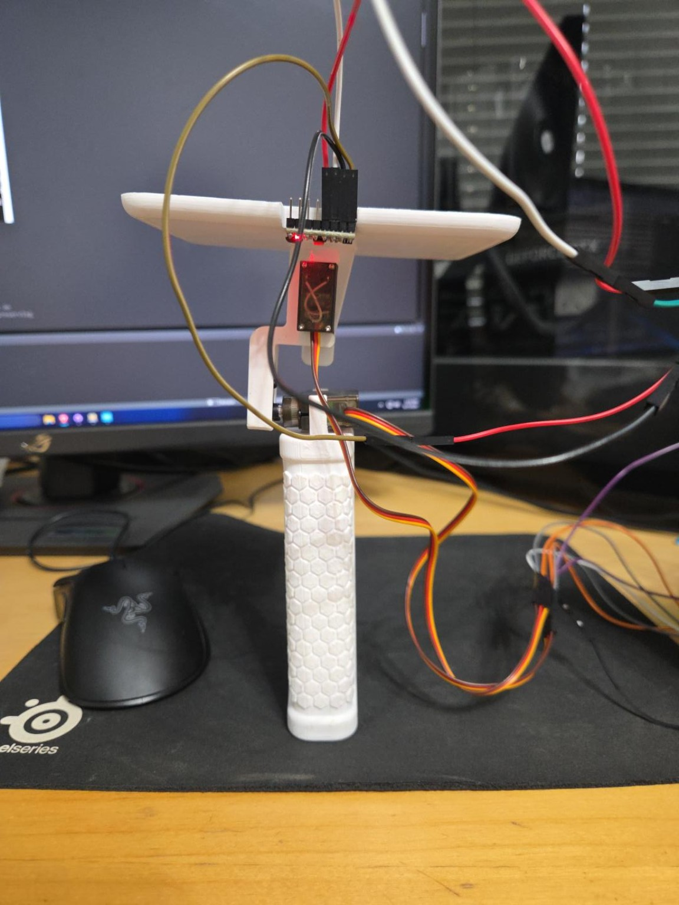

# STM32F446RE MPU6050 Two-Axis Gimbal

Closed-loop stabilization project built in embedded C with an STM32F446RE, MPU6050 IMU, and two MG90S servos. The firmware captures the startup attitude as its reference, estimates pitch and roll at 100 Hz, and drives both axes toward that reference.

<p align="center">
  
</p>

<p align="center"><em>V2 prototype used for the current closed-loop controller and telemetry validation.</em></p>

## Demo

Current V2 prototype running startup-relative two-axis stabilization.

[https://github.com/user-attachments/assets/YOUR-VIDEO-ID](https://github.com/user-attachments/assets/4cda6c70-4782-4603-9b97-95a0b9cd7fd2)

## Current Status

The current firmware demonstrates startup-relative, two-axis closed-loop stabilization with:

- calibrated MPU6050 acceleration and gyro measurements;
- adaptive complementary-filter pitch and roll estimation;
- PI position control with direct gyro-rate damping;
- 0.5° attitude-error deadband;
- sign-aware integral unwinding without a hard integral clamp;
- conditional anti-windup at actuator saturation;
- 250°/s servo-command slew limiting;
- timer-scheduled 100 Hz control and 20 Hz CSV telemetry;
- I2C bus recovery after rapid resets.

The latest paired video/telemetry run is preserved in [`closed_loop_stabilization_2026-09-14.xlsx`](docs/validation/spreadsheets/closed_loop_stabilization_2026-09-14.xlsx). The main remaining limitation is overshoot and hunting after large manual returns, driven by controller state interacting with MG90S backlash, stiction, and direction-dependent response.

## Control Architecture

```text
MPU6050
   |
   v
Calibration and gyro-bias removal
   |
   v
Adaptive complementary filter
   |
   v
Absolute pitch and roll
   |
   v
Startup-reference subtraction
   |
   v
Relative pitch and roll
   |
   v
PI position control + gyro-rate damping
   |
   v
Command clamp and slew limiter
   |
   v
Calibrated MG90S pitch and roll servos
```

The adaptive filter shifts from `alpha = 0.98` when the accelerometer is trusted toward gyro-only operation at `alpha = 1.00` during high acceleration or angular rate. Pitch uses `atan2(AX, -AZ)` with `+GY`; roll uses `atan2(AY, sqrt(AX² + AZ²))` with `-GX` for the current upside-down sensor mounting.

## Demonstrated Configuration

| Parameter | Pitch | Roll |
|---|---:|---:|
| Proportional gain `Kp` | 1.25 | 1.25 |
| Integral gain `Ki` | 1.00 | 1.00 |
| Numerical derivative gain `Kd` | 0.00 | 0.00 |
| Direct rate gain `Krate` | 0.05 | 0.05 |
| Attitude deadband | 0.5° | 0.5° |
| Rate deadband | 1.0°/s | 1.0°/s |
| Servo center | 1400 µs | 1550 µs |
| Tested PWM range | 500–2500 µs | 500–2500 µs |

Other active limits: ±60° servo-offset command, ±15° direct rate contribution, 3× integral unwind when error opposes the stored integral state, and 250°/s servo-command slew rate.

## Demo Telemetry Snapshot

The curated 40-second window contains 800 telemetry samples and covers baseline, deliberate disturbances, and settling:

| Measurement | Observed maximum |
|---|---:|
| Startup-relative pitch | 15.87° |
| Startup-relative roll | 12.21° |
| Pitch servo-offset command | 60.00° |
| Roll servo-offset command | 56.54° |
| Measured sample interval | 0.0100 s mean |

These values describe the test capture rather than universal performance limits. The full controller terms and estimator diagnostics remain available in the workbook.

## Hardware and Timing

| Component | Configuration |
|---|---|
| MCU | NUCLEO-F446RE |
| IMU | MPU6050 over I2C1 |
| Pitch servo | MG90S on TIM8 CH2 |
| Roll servo | MG90S on TIM4 CH1 |
| Servo PWM | 50 Hz |
| Control scheduler | TIM6, 100 Hz |
| Telemetry | USART2, 460800 baud, blocking transmit at 20 Hz |

TIM6 increments a scheduler tick in the interrupt callback. Sensor reads, filtering, controller calculations, and telemetry formatting remain in the main context rather than the ISR. Missed timer periods are not replayed as artificial catch-up samples.

## Validation

The repository keeps curated engineering evidence in [`docs/validation`](docs/validation/README.md):

- paired closed-loop motion and controller telemetry;
- deadband suppression testing;
- servo-command slew-rate verification;
- V1/V2 hysteresis, breakaway, repeatability, and cross-axis characterization;
- raw-PWM and static-step testing.

V2 testing showed same-command pitch branch gaps up to 2.336°, platform motion of approximately 0.77–0.87× the requested servo angle for ±20° commands, and cross-axis coupling near 3–5%. Those measurements explain why near-center performance is limited more by hobby-servo mechanics than by cross-axis coupling.

## Firmware Organization

| Module | Purpose |
|---|---|
| `mpu6050.c/.h` | Sensor initialization, reads, conversion, and calibration |
| `imu_filter.c/.h` | Timing and adaptive complementary-filter attitude estimation |
| `servo.c/.h` | PWM output and calibrated pulse/offset conversion |
| `gimbal.c/.h` | PI control, integral handling, gyro-rate damping, limits, and slew control |
| `i2c_manager.c/.h` | I2C1 bus recovery |
| `main.c` | Startup reference, 100 Hz scheduling, estimator/controller flow, and CSV telemetry |

The project retains earlier telemetry, system-health, DMA, and power-monitor modules as development work, but the current demo path sends its expanded controller telemetry directly from `main.c`.

## Telemetry Fields

```text
Time_ms, dt,
AbsPitch_deg, AbsRoll_deg,
RelativePitch_deg, RelativeRoll_deg,
PitchRate_dps, RollRate_dps,
AccelMag_g, GyroMag_dps, AccelTrust, Alpha,
PitchError_deg, RollError_deg,
PitchP_deg, RollP_deg,
PitchI_deg, RollI_deg,
PitchRateTerm_deg, RollRateTerm_deg,
PitchCommand_deg, RollCommand_deg
```

## Mechanical Evolution

<p align="center">
  
</p>

<p align="center"><em>V1 prototype used to develop the sensor, timing, servo, and mechanical-characterization workflow.</em></p>

V2 stiffened and better centered the upper stage, making the remaining backlash, stiction, gearbox behavior, linkage compliance, and load asymmetry easier to isolate through telemetry.

## Next Steps

1. Quantify rise time, settling time, overshoot, and steady-state error with repeatable disturbances.
2. Refine stale-integral unwinding without reintroducing the hard clamp that degraded physical testing.
3. Compare the MG90S mechanism with lower-backlash actuators or purpose-built gimbal motors.
4. Restore nonblocking telemetry if expanded logging begins to affect control-loop execution time.

## Skills Demonstrated

Embedded C, STM32 HAL/CubeMX, I2C, PWM, timer-based scheduling, IMU calibration, sensor fusion, closed-loop control, UART telemetry, fault recovery, and quantitative electromechanical validation.
