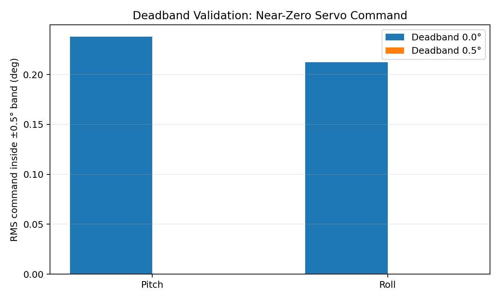
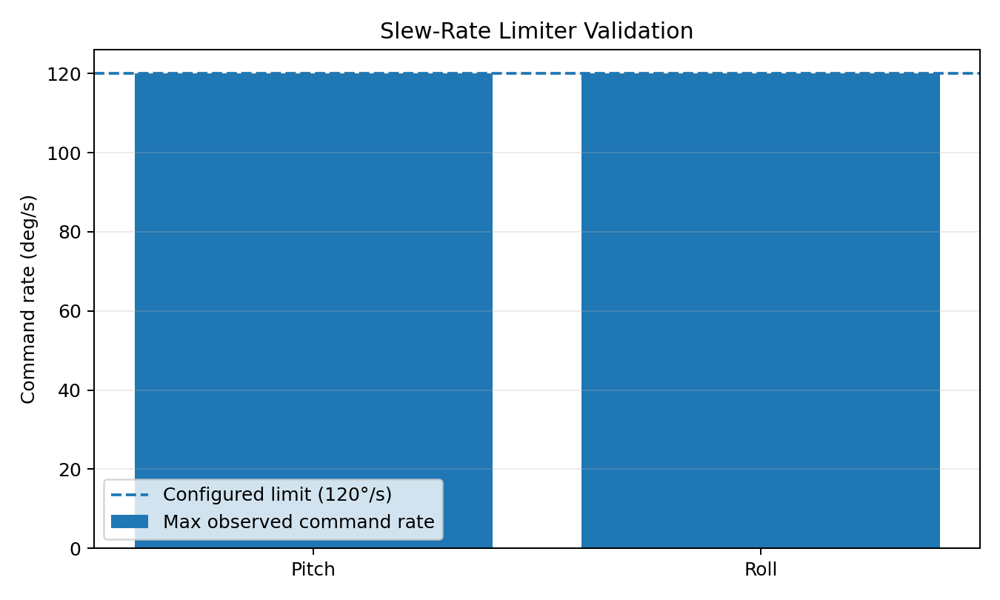

# Validation and Test Data

This directory contains the curated evidence used to verify controller behavior and characterize the gimbal mechanics. It preserves the tests behind firmware decisions without storing every development log.

## Included Tests

| Test | Main result | Artifact |
|---|---|---|
| Closed-loop stabilization | Paired demo window with estimator state, PI terms, gyro-rate damping, and servo commands | [`closed_loop_stabilization_2026-09-14.xlsx`](spreadsheets/closed_loop_stabilization_2026-09-14.xlsx) |
| Deadband baseline | With no deadband, near-zero command RMS was **0.238° pitch** and **0.212° roll** | [`deadband_baseline_db0.xlsx`](spreadsheets/deadband_baseline_db0.xlsx) |
| 0.5° deadband | 100% of samples inside the ±0.5° measured-angle band produced a 0° servo command | [`deadband_validation_db0p5.xlsx`](spreadsheets/deadband_validation_db0p5.xlsx) |
| 120°/s slew limiter | Aggressive reversals reached the configured **120°/s** ceiling on both axes with no observed violations | [`slew_rate_aggressive_reversal_120dps.xlsx`](spreadsheets/slew_rate_aggressive_reversal_120dps.xlsx) |
| V1/V2 servo hysteresis | Direction-dependent breakaway, branch gaps, repeatability error, raw-PWM state dependence, and non-1:1 servo/platform gain | [`hysteresis.md`](hysteresis.md) |
| Hysteresis workbook | Consolidated V1/V2 analysis with raw telemetry sheets | [`servo_hysteresis_characterization_v1_v2.xlsx`](spreadsheets/servo_hysteresis_characterization_v1_v2.xlsx) |

## Closed-Loop Stabilization — September 14, 2026

The current demo uses startup-relative two-axis stabilization at a 100 Hz control rate with 20 Hz telemetry. Both axes used `Kp = 1.25`, `Ki = 1.00`, `Kd = 0`, and direct gyro-rate gain `Krate = 0.05`. The controller also used a 0.5° attitude deadband, conditional anti-windup at output saturation, sign-aware 3× integral unwinding, and 250°/s servo-command slew limiting.

The workbook contains the 90–130 s portion of the run paired with the demo video: a stationary baseline, deliberate disturbances, manual return, and settling. It excludes the several-minute stationary tail and one incomplete final CSV row from the supplied text capture.

Observed within this test window:

- maximum startup-relative pitch magnitude: **15.87°**;
- maximum startup-relative roll magnitude: **12.21°**;
- maximum pitch servo-offset command: **60.00°**;
- maximum roll servo-offset command: **56.54°**;
- mean controller sample interval: **0.0100 s**.

The run demonstrates functional two-axis correction and also preserves the remaining limitation: after large manual returns, stored integral state and MG90S hysteresis can produce overshoot and hunting. The tested firmware uses faster sign-aware integral unwinding rather than the hard integral clamp that degraded earlier physical tests.

## Deadband Validation

Inside the ±0.5° measured-angle region:

- pitch command RMS fell from **0.238° to 0.000°**;
- roll command RMS fell from **0.212° to 0.000°**;
- the 0.5° configuration suppressed **100%** of in-band pitch and roll commands.

This verifies that the control-error deadband removes small command chatter near level rather than merely reducing it.



## Slew-Rate Validation

Measured results from the aggressive reversal test:

- maximum observed pitch command rate: **120.0°/s**;
- maximum observed roll command rate: **120.0°/s**;
- configured limit for that test: **120°/s**;
- near-limit hits: **119 pitch**, **30 roll**;
- observed rate-limit violations: **0**;
- final 5 s roll peak-to-peak motion: approximately **0.190°**.



## Servo and Mechanical Hysteresis

V1 and V2 testing showed that the MG90S gearbox and linkage cannot be modeled as one fixed symmetric deadband.

Key V2 findings include:

- maximum measured pitch staircase branch gap: **2.336°**;
- maximum measured roll staircase branch gap: **0.482°**;
- identical pitch −1.0° commands produced responses of **+1.843°, +0.020°, and −0.008°** across repeated trials;
- raw-PWM response remained direction- and history-dependent;
- ±20° servo commands produced approximately **0.77–0.87** platform-angle gain;
- cross-axis coupling remained relatively low at approximately **3–5%**.

Detailed methodology, tables, and control implications are documented in [`hysteresis.md`](hysteresis.md).

## Engineering Interpretation

The firmware can generate sub-degree corrections, but the hobby-servo mechanism does not reproduce those commands symmetrically or repeatably near center. Stabilization repeatedly crosses the same reversal region:

```text
small attitude error
→ small servo correction
→ backlash or static friction absorbs part of the command
→ controller state continues changing
→ mechanism breaks free
→ controller reverses through the hysteresis region
```

The current controller therefore combines a 0.5° attitude deadband, PI control, direct gyro-rate damping, conditional saturation anti-windup, sign-aware integral unwinding, and command slew limiting. This improves the working demo while keeping the actuator limitation visible and measurable.

## Data Notes

- IMU/controller telemetry is logged as CSV over USART2.
- Current deterministic controller timing is 100 Hz with telemetry decimated to 20 Hz.
- The current demo uses blocking UART transmit at the decimated telemetry rate; earlier DMA work remains in the repository but is not the active `main.c` telemetry path.
- Servo-command degrees are not assumed to equal platform degrees because linkage geometry, load, internal servo behavior, backlash, friction, and compliance affect the transfer ratio.
- Raw telemetry for the principal hysteresis tests remains inside the consolidated hysteresis workbook.
