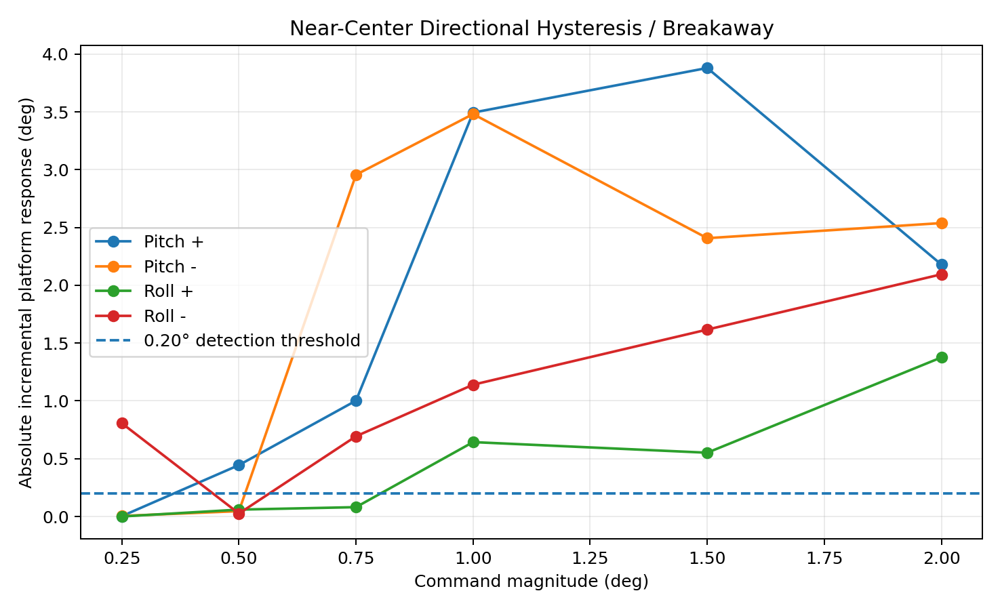

# Validation & Test Data

This directory contains the curated validation artifacts used to verify controller behavior and characterize the V1 mechanics.

The goal is to preserve the engineering evidence behind the firmware decisions without turning the repository into a dump of every development log.

## Included Tests

| Test | Main result | Workbook |
|---|---|---|
| Deadband baseline | With no deadband, near-zero command RMS was **0.238° pitch** and **0.212° roll** | [`deadband_baseline_db0.xlsx`](spreadsheets/deadband_baseline_db0.xlsx) |
| 0.5° deadband | 100% of samples inside the ±0.5° measured-angle band produced a 0° servo command | [`deadband_validation_db0p5.xlsx`](spreadsheets/deadband_validation_db0p5.xlsx) |
| 120°/s slew limiter | Aggressive reversals reached the configured **120°/s** ceiling on both axes; no rate-limit violations were observed | [`slew_rate_aggressive_reversal_120dps.xlsx`](spreadsheets/slew_rate_aggressive_reversal_120dps.xlsx) |
| Near-center mechanics | Direction-dependent breakaway and hysteresis were measured around center, showing that V1 does not have one clean symmetric mechanical deadband | [`servo_hysteresis_near_center.xlsx`](spreadsheets/servo_hysteresis_near_center.xlsx) |

## Deadband Validation

The deadband experiment compares a zero-deadband baseline against the active 0.5° deadband.

Inside the ±0.5° measured-angle region:

- pitch command RMS fell from **0.238° to 0.000°**
- roll command RMS fell from **0.212° to 0.000°**
- the 0.5° configuration suppressed **100%** of in-band pitch and roll commands

This verifies that the deadband removes small command chatter near level rather than merely reducing it.


## Slew-Rate Validation

The aggressive reversal test was used specifically to force the limiter to engage.

Measured results:

- maximum observed pitch command rate: **120.0°/s**
- maximum observed roll command rate: **120.0°/s**
- configured limit: **120°/s**
- near-limit hits: **119 pitch**, **30 roll**
- observed rate-limit violations: **0**
- final 5 s roll peak-to-peak motion: approximately **0.190°**

The limiter therefore reaches, but does not exceed, the configured ceiling during aggressive reversals.


## V1 Near-Center Mechanical Characterization

A focused open-loop servo test commanded each axis through:

```text
0
±0.25°
0
±0.50°
0
±0.75°
0
±1.00°
0
±1.50°
0
±2.00°
0
```

Each position was held for 1.5 s, and the final 0.5 s was used as the settled response.

The response is strongly direction- and history-dependent. In this sequence:

- pitch + first showed clear movement around **+0.50°**
- pitch - first showed clear movement around **-0.75°**
- roll + first showed clear movement around **+1.00°**
- roll - responded at smaller commands, but not consistently enough to define a single threshold

This is not best described as one fixed servo deadband. The V1 assembly combines servo gear backlash, internal servo deadband, linkage compliance, static friction, gravity loading, and a non-flush horn/control-arm joint.



## Engineering Interpretation

The V1 control software can generate sub-degree corrections, but the mechanics do not reproduce those commands symmetrically or repeatably around center.

That matters because a stabilization controller repeatedly reverses direction near the setpoint:

```text
small error
→ small servo correction
→ mechanical play / breakaway absorbs part of the command
→ error continues to grow
→ mechanism finally moves
→ controller reverses
→ hysteresis is encountered again
```

This can create a small limit cycle or wobble even when the controller timing and arithmetic are correct.

For that reason, V1 is being treated as a **functional validation and characterization platform**. Final integral and derivative tuning is deferred until the V2 mechanical revision reduces play and improves the servo-horn/control-arm interface.

## Data Notes

- IMU/controller telemetry was logged as CSV over USART2.
- Current deterministic controller timing is 100 Hz with telemetry decimated to 20 Hz; some earlier validation workbooks were captured before the final TIM6 scheduling upgrade and therefore show the older ~40 Hz loop timing.
- Servo-command degrees are not assumed to equal platform degrees because linkage geometry and compliance affect the mechanical transfer ratio.
- The original raw telemetry used for each analysis is preserved inside the included workbooks.
